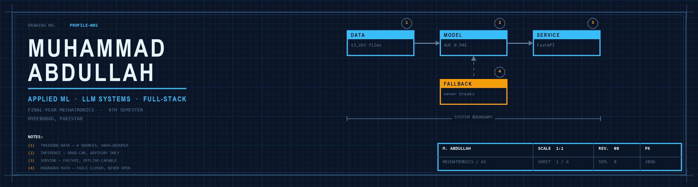

<div align="center">


<a href="https://www.linkedin.com/in/abdullah-kaimkhani-09b1292b9/">
</a>
<a href="mailto:bbr70686@gmail.com">
</a>


</div>

---

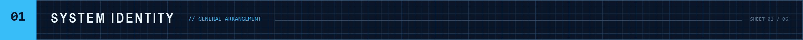

I build applied-ML and LLM systems end to end — train the model, wrap it in a service that fails gracefully, and put a real interface in front of it. The part I care most about is what happens when the model is wrong, the network is gone, or the data is thinner than the claim.

Most of what follows is about that.

---

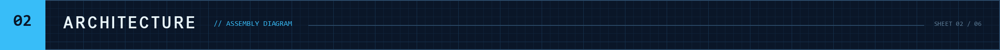

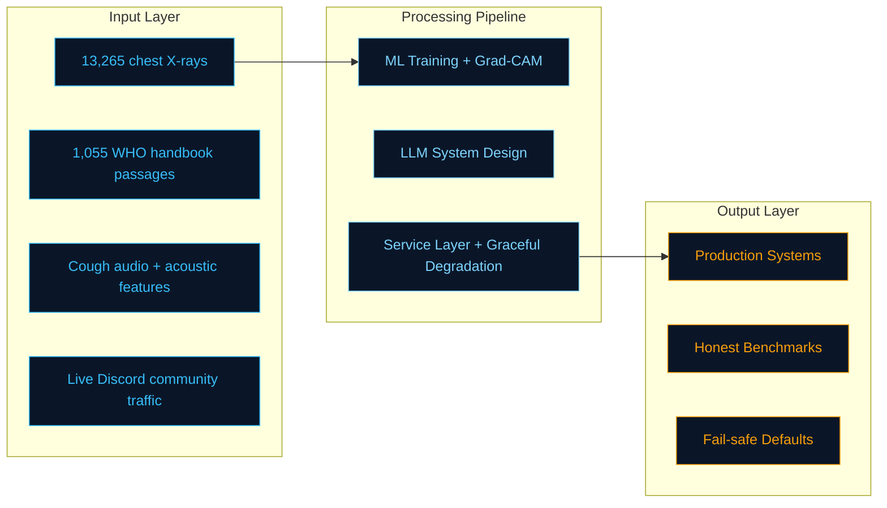

> **Cross-cutting concerns applied to every layer:**
> Security · Privacy by default · Observability · Graceful degradation

---

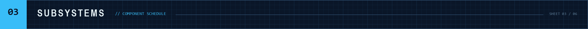

### `01` Saans — Paediatric TB Screening

> Offline-first tablet app for community health workers implementing the WHO *Operational Handbook on Tuberculosis, Module 5* (2022) decision algorithm. Three ML assists inform the health worker and are **structurally prevented** from changing the score.

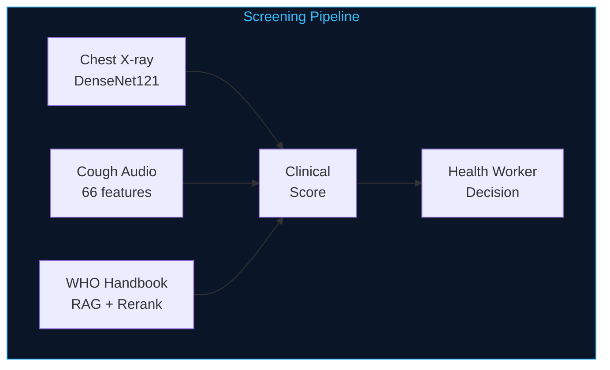

`0.942` AUC, honest single-site benchmark &nbsp;·&nbsp; `95.1%` recall (271/285) &nbsp;·&nbsp; `98.2%` specificity &nbsp;·&nbsp; `13,265` films across 4 hash-deduped sources

> **The reported AUC is 0.942, not the 0.995 the pooled test set produces.** One source draws its TB and normal films from different collections that differ for reasons unrelated to disease, so the model separates them without reading pathology. The honest benchmark is the single hospital where both classes share equipment. Quoting the inflated number would have been easy, and wrong.

**Technical detail.** Two-stage local retrieval — MiniLM bi-encoder on ONNX Runtime, then cross-encoder rerank, ~3 ms, refusing before it ever calls an API. No public paediatric dataset exists, so every model was trained on adults and scored *by age band* rather than assumed to transfer. Bilingual EN/UR with full RTL, installable PWA, fully offline.

    

**[-> Read the code and the limitations](https://github.com/ra189zor/Saans)** &nbsp; 

---

### `02` Discord AI Platform — Automation and Security

> Event-driven Discord bot + LLM interaction pipeline + FastAPI control panel, running as one async application. Closed-source — engineering described, not linked.

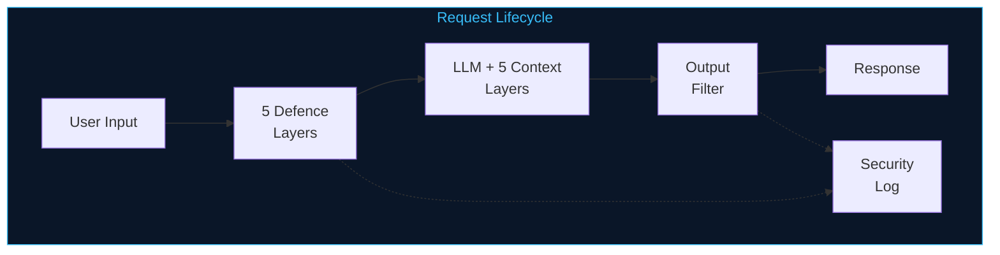

`5` defence layers against prompt injection &nbsp;·&nbsp; `5` context layers per LLM call &nbsp;·&nbsp; `11` background loops &nbsp;·&nbsp; `37` slash commands

> **Treating the LLM as untrusted, in both directions.** User input is delimiter-wrapped and pre-filtered for jailbreak patterns; tools are sandboxed with zero `eval`/`exec` and every query partitioned by guild; generated output is post-filtered for system-prompt leakage before it reaches anyone. Blocked inputs and leaked outputs are both written to a security log the admin panel surfaces — an attack surface you can actually watch.

**Engineering highlights.** Thread-safe multi-key rotation pool reads `x-ratelimit-remaining-*` headers off every response to rotate *before* limits land, and honours `retry-after` cooldowns on 429. Token budget manager trims conversation history and drops tool definitions dynamically to stay under the per-minute ceiling instead of failing with a 413. Five-layer context injection per call, LLM function calling for persistent memory, async SQLite on `aiosqlite` (WAL, startup migrations, `contextvars`-scoped connections), internal HTTP API for bot-dashboard IPC, fails-closed feature flags, and a Pillow canvas renderer for generated cards.

     

---

### Supporting Systems

| Project | What it is | Stack |
|:--|:--|:--|
| **[llm-observe-hub](https://github.com/ra189zor/llm-observe-hub)** | OpenAI-compatible proxy that instruments local LLMs — streaming pass-through, per-request cost and latency, alert engine, budgets. | `FastAPI` `SQLAlchemy` `httpx` |
| **[WorkflowWizard](https://github.com/ra189zor/WorkflowWizard)** | Plain-English descriptions to validated, importable n8n workflow JSON. Session auth, Postgres, billing, usage metering. | `React` `TypeScript` `Drizzle` `Neon` |
| **[MCP-Studio](https://github.com/ra189zor/MCP-Studio)** | Generates and validates MCP servers, fanning one task across Anthropic, OpenAI and Google models in parallel. | `asyncio` `PostgreSQL` `Streamlit` |


<sub>**[MindFlow](https://github.com/ra189zor/MindFlow)** and **[JobNexus](https://github.com/ra189zor/JobNexus)** are where the multi-agent pattern I keep reaching for got worked out: specialist agents behind a validator that checks their output against the original constraints and returns it for revision until it passes or hits a cap. Also built: **[fraud-detection-agent](https://github.com/ra189zor/fraud-detection-agent)** — hybrid Isolation Forest / One-Class SVM with a six-signal rule engine; **[AI-Venture-Capital-Scout](https://github.com/ra189zor/AI-Venture-Capital-Scout)** — CrewAI agent crew paired with a TensorFlow founder-success model.</sub>

---

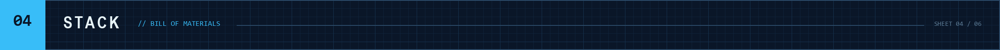

**ML & Vision** &nbsp;      

**LLM systems** &nbsp;      

**Backend** &nbsp;      

**Frontend & Infra** &nbsp;      

---

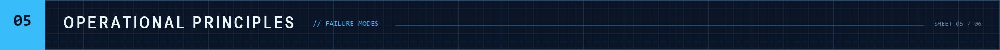

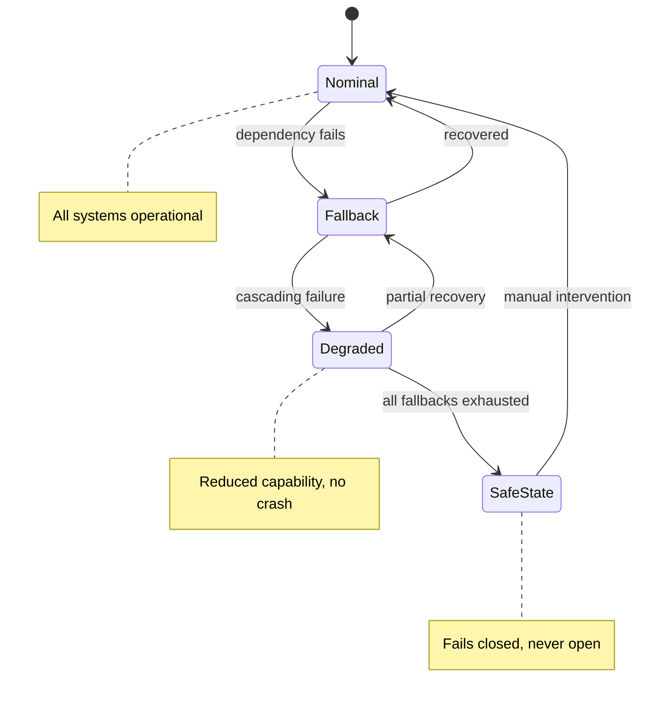

| # | Principle | Evidence |
|:--|:--|:--|
| `01` | **Measure instead of assuming** | Cough model scored by age band since it was trained on adults. Three embedding models benchmarked — the 440 MB candidates were *worse*, so the 87 MB one shipped. |
| `02` | **Degrade, don't break** | No API key, no reranker, no network, no model weights, no rate-limit headroom — each has a defined fallback. Energy-based burst detector runs beside the trained classifier. |
| `03` | **Read the dependency graph** | ChromaDB rejected because its protobuf silently breaks TensorFlow. TF pinned below 2.16 because Keras 3 cannot build the Grad-CAM sub-model. Reasoning lives in `requirements.txt`. |
| `04` | **Safe and private by default** | Field data collection off by default, consent per capture, nothing identifying written. Feature flags fail closed. LLM output filtered before reaching any user. |

---

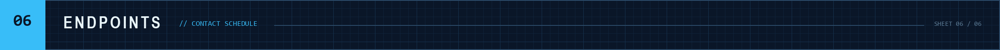

```yaml
GET /contact:
  - type: LinkedIn
    uri: https://www.linkedin.com/in/abdullah-kaimkhani-09b1292b9/
  - type: Email
    uri: bbr70686@gmail.com
  - type: Repositories
    uri: https://github.com/ra189zor?tab=repositories
```

> **Open to internships and junior roles in ML engineering and applied AI** — happy to talk through any of the work above, including the parts that didn't work.

<a href="https://www.linkedin.com/in/abdullah-kaimkhani-09b1292b9/">
</a>
<a href="mailto:bbr70686@gmail.com">
</a>
<a href="https://github.com/ra189zor?tab=repositories">
</a>

<sub>


</sub>
